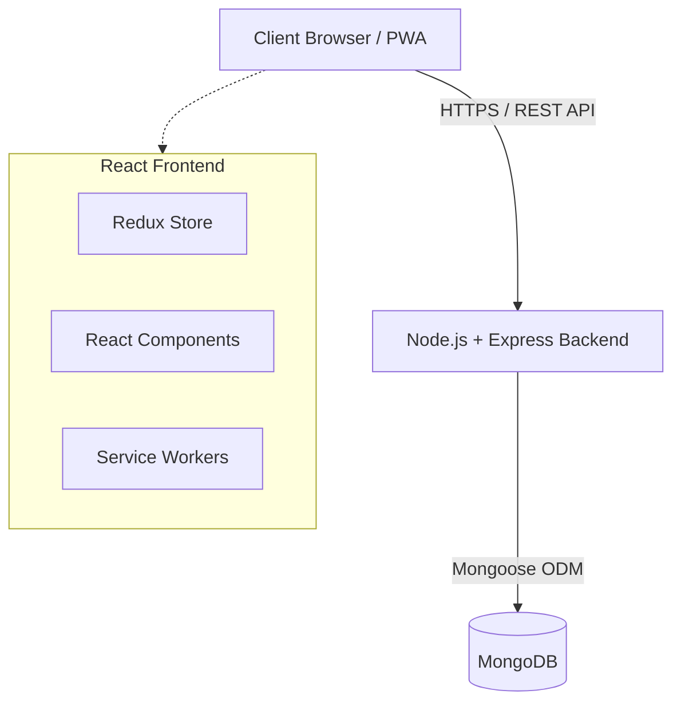
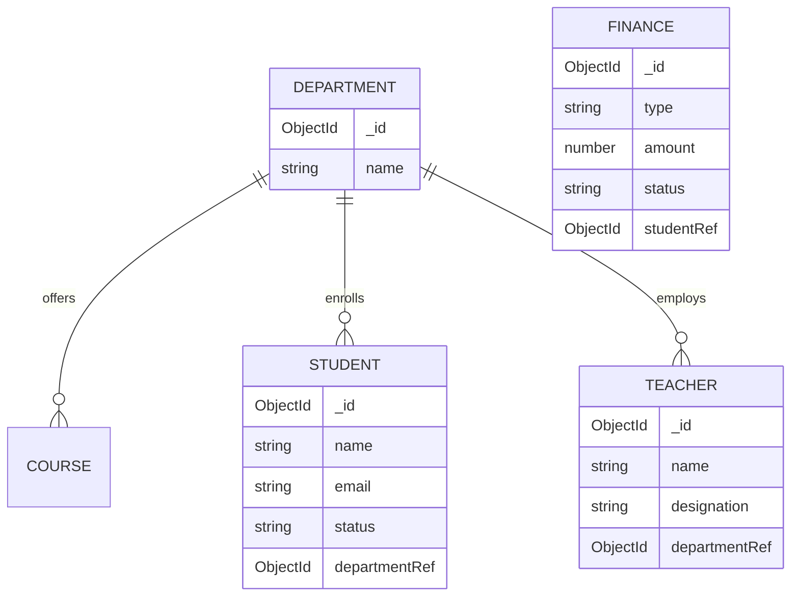

# UNIVERSITY MANAGEMENT SYSTEM USING MERN STACK
## FINAL YEAR PROJECT DOCUMENTATION

---

## DECLARATION
We hereby declare that this project report entitled **"University Management System Using MERN Stack"** is an authentic record of our own work carried out as a final year project requirement. The matter embodied in this report has not been submitted by us for the award of any other degree or diploma.

## APPROVAL PAGE
This project report has been approved as satisfying the academic requirements for the degree of Bachelor of Science in Software Engineering.

## DEDICATION
This work is dedicated to our parents, teachers, and friends who have supported us throughout our academic journey.

## ACKNOWLEDGMENT
We express our deepest gratitude to our project supervisor and the entire faculty of the Computer Science and Software Engineering department for their continuous guidance, support, and invaluable feedback. 

## ABSTRACT
The administration of modern universities involves handling massive volumes of data pertaining to students, faculty, courses, finance, and campus facilities. Traditional manual systems and legacy software are often siloed, slow, and prone to human error. This project presents **UniERP**, a comprehensive, cloud-ready **University Management System** developed using the **MERN stack** (MongoDB, Express.js, React.js, Node.js). The system features a centralized, role-based architecture that integrates modules for Student Management, Faculty Management, Courses & Departments, Finance, Library, Hostel, and Transport. By leveraging modern web technologies, including Progressive Web App (PWA) capabilities, Redux for global state management, and real-time data synchronization, UniERP provides a seamless, responsive, and cross-platform experience. The result is a highly scalable, secure, and efficient enterprise resource planning (ERP) solution tailored for modern academic institutions.

---

## TABLE OF CONTENTS
1. [Chapter 1: Introduction](#chapter-1-introduction)
2. [Chapter 2: Literature Review](#chapter-2-literature-review)
3. [Chapter 3: System Analysis](#chapter-3-system-analysis)
4. [Chapter 4: System Design](#chapter-4-system-design)
5. [Chapter 5: Database Design](#chapter-5-database-design)
6. [Chapter 6: Implementation](#chapter-6-implementation)
7. [Chapter 7: Modules Explanation](#chapter-7-modules-explanation)
8. [Chapter 8: Testing & Validation](#chapter-8-testing--validation)
9. [Chapter 9: Security & Performance](#chapter-9-security--performance)
10. [Chapter 10: Results & Discussion](#chapter-10-results--discussion)
11. [Chapter 11: Conclusion & Recommendations](#chapter-11-conclusion--recommendations)

---

# CHAPTER 1: INTRODUCTION

### 1.1 Background of the Study
The rapid advancement of Information Technology has revolutionized the operational paradigms of various sectors, including education. Universities are complex organizations that manage thousands of students, hundreds of staff members, and intricate financial and academic records. Historically, these institutions relied on paper-based records or fragmented legacy software, leading to data redundancy, security vulnerabilities, and immense administrative overhead. 

### 1.2 Problem Statement
Current administrative systems in many universities suffer from several critical issues:
- **Data Fragmentation:** Different departments use isolated systems, meaning a student's financial data is not easily synchronized with their academic data.
- **Lack of Accessibility:** Legacy systems are often restricted to on-premise local networks, lacking mobile responsiveness and remote access capabilities.
- **High Maintenance Costs:** Maintaining outdated, monolithic architectures is expensive and difficult to scale.
- **Poor User Experience:** Outdated User Interfaces (UI) lead to steep learning curves and decreased productivity for staff.

### 1.3 Purpose of the System
The purpose of the UniERP system is to centralize, digitize, and automate the core administrative and academic workflows of a university. It provides a unified platform where administrators, teachers, and students can interact with real-time data through a modern, web-based interface.

### 1.4 Objectives
- **Primary Objective:** To design and implement a web-based University Management System using the MERN stack.
- **Secondary Objectives:**
  - To develop a responsive, PWA-enabled frontend using React and Tailwind CSS.
  - To implement secure JWT-based authentication and role-based access control (RBAC).
  - To create modular interfaces for Finance, Library, Hostel, and Transport management.
  - To ensure dynamic data synchronization across modules using Redux global state.

### 1.5 Scope of the Project
The scope of UniERP includes the complete lifecycle of university administration from the perspective of the Super Admin and Staff. It encompasses Department and Course generation, Student and Faculty registration, Invoice and Expense tracking, and ancillary services (Library, Hostel, Transport). It does not currently cover advanced automated payroll calculations or an integrated Learning Management System (LMS) video hosting platform, which are reserved for future scope.

### 1.6 Significance of the Study
This project demonstrates the viability of modern JavaScript ecosystems (MERN) in building enterprise-grade applications. It provides a blueprint for educational institutions looking to undergo digital transformation without incurring the astronomical licensing fees of proprietary ERPs like SAP or Oracle.

### 1.7 Research Methodology
The Agile Software Development methodology was adopted. The system was built in iterative sprints, starting with UI prototyping, followed by database schema design, REST API development, frontend integration, and finally PWA optimization and testing.

---

# CHAPTER 2: LITERATURE REVIEW

### 2.1 Existing University Systems
Historically, universities have utilized systems like Blackboard, Canvas, and localized Oracle ERPs. While powerful, these systems are notoriously rigid. Traditional systems process data in batches rather than in real-time and often require dedicated IT teams to maintain physical servers.

### 2.2 ERP Systems Overview
Enterprise Resource Planning (ERP) systems integrate varied organizational systems and facilitate error-free transactions and production. In an educational context, an ERP integrates admissions, academics, HR, and finance.

### 2.3 Web-Based Management Systems & Modern SaaS
Software as a Service (SaaS) models have proven that complex administrative tasks can be handled securely over the web. Modern systems utilize Single Page Application (SPA) architectures to provide fluid, app-like experiences inside the browser without full page reloads.

### 2.4 MERN Stack Overview
- **MongoDB:** A NoSQL database that stores data in flexible, JSON-like documents. Ideal for handling unstructured educational data.
- **Express.js:** A minimal and flexible Node.js web application framework providing a robust set of features for web and mobile applications.
- **React.js:** A declarative, efficient, and flexible JavaScript library for building user interfaces, developed by Meta.
- **Node.js:** A JavaScript runtime built on Chrome's V8 engine, enabling non-blocking, event-driven backend architecture.

### 2.5 Advantages of Digital University Systems
Digitization ensures data integrity, rapid data retrieval, automated backups, and real-time analytics. Furthermore, with the implementation of PWA standards, the UniERP system can be installed as a native desktop application, providing offline caching and push notifications.

---

# CHAPTER 3: SYSTEM ANALYSIS

### 3.1 Proposed System Analysis
The proposed UniERP system eliminates paper trails and manual ledgers. It introduces a cloud-ready web application accessible from any device. The system features a centralized dashboard providing high-level analytics (Total Revenue, Active Students) fetched dynamically from the database.

### 3.2 Functional Requirements
- **Authentication:** The system must allow users to log in securely using email and password.
- **Department Management:** Admins must be able to create, read, update, and delete (CRUD) academic departments.
- **User Management:** The system must handle the registration of Students and Faculty, linking them dynamically to the created departments.
- **Finance Module:** The system must generate fee invoices and track institutional expenses.
- **PWA Capabilities:** The application must be installable on desktop and mobile operating systems.

### 3.3 Non-Functional Requirements
- **Performance:** Dashboard metrics must load in under 2 seconds.
- **Security:** All API endpoints must be protected by JWT middleware. Passwords must be hashed using bcrypt.
- **Usability:** The interface must be fully responsive, adapting to mobile, tablet, and desktop screens.
- **Availability:** The system should target 99.9% uptime, facilitated by stateless backend architecture and cloud deployment.

### 3.4 Feasibility Study
- **Technical Feasibility:** Highly feasible. The MERN stack is mature, heavily documented, and supported by a massive open-source community.
- **Economic Feasibility:** Feasible. Using open-source technologies (React, Node, MongoDB) eliminates software licensing costs.
- **Operational Feasibility:** Feasible. The intuitive UI designed with Tailwind CSS minimizes the training required for university staff.

### 3.5 Use Case Analysis

```mermaid
usecaseDiagram
    actor SuperAdmin
    actor Student
    actor Teacher
    
    package "UniERP System" {
        usecase "Login & Authentication" as UC1
        usecase "Manage Departments" as UC2
        usecase "Manage Students/Teachers" as UC3
        usecase "Manage Finances" as UC4
        usecase "View Dashboard Analytics" as UC5
    }
    
    SuperAdmin --> UC1
    SuperAdmin --> UC2
    SuperAdmin --> UC3
    SuperAdmin --> UC4
    SuperAdmin --> UC5
    
    Teacher --> UC1
    Teacher --> UC5
    
    Student --> UC1
    Student --> UC5
```

---

# CHAPTER 4: SYSTEM DESIGN

### 4.1 System Architecture
The system follows a strict Client-Server architecture utilizing the REST paradigm. The frontend (React) communicates with the backend (Node/Express) via asynchronous HTTP requests (Axios).



### 4.2 Frontend Architecture
Built with Vite for ultra-fast Hot Module Replacement (HMR) during development and highly optimized builds for production. The state is managed globally using **Redux Toolkit**. For example, the `departmentSlice` holds the master list of departments, which populates the `<select>` dropdowns in the `Students.tsx` and `Teachers.tsx` components.

### 4.3 Backend Architecture
The backend is structured using the MVC (Model-View-Controller) pattern, though acting purely as an API (Model-Controller-Route). 
- **Routes:** Define API endpoints (e.g., `/api/students`).
- **Controllers:** Handle business logic and database interactions.
- **Models:** Define the data structure using Mongoose Schemas.

### 4.4 UI/UX Design Principles
- **Glassmorphism & Modernism:** Soft shadows, rounded corners, and subtle background blurs.
- **Consistency:** Uniform color palettes (deep purples and emeralds) and typography (Inter font).
- **Feedback:** Immediate visual feedback via modals and toast notifications after CRUD operations.

---

# CHAPTER 5: DATABASE DESIGN

### 5.1 ER Diagram
The database is relational by logic but document-oriented by nature, using MongoDB ObjectId references to link collections.



### 5.2 Schema Design
Mongoose schemas enforce data validation at the application layer. For example, the Student schema mandates `name` and `email` as required fields and references the `Department` model, ensuring referential integrity.

---

# CHAPTER 6: IMPLEMENTATION

### 6.1 Frontend Implementation
The frontend is initialized using `vite create`. Routing is handled by `react-router-dom`. The layout utilizes a persistent sidebar (`DashboardLayout.tsx`) that wraps all nested routes using the `<Outlet />` component.

### 6.2 Global State (Redux Toolkit)
To eliminate prop-drilling, Redux is implemented. The architecture features slices like `departmentSlice.ts`, `studentSlice.ts`, and `teacherSlice.ts`. 

```typescript
// Example: Global Department State
const departmentSlice = createSlice({
  name: 'departments',
  initialState: { list: [] },
  reducers: {
    addDepartment: (state, action) => { state.list.push(action.payload); },
    deleteDepartment: (state, action) => { 
      state.list = state.list.filter(d => d.id !== action.payload); 
    },
  },
});
```

### 6.3 PWA Implementation
The `vite-plugin-pwa` is heavily configured. The `manifest` object inside `vite.config.ts` dictates the desktop app behavior, setting `display: 'standalone'` and providing `192x192` and `512x512` SVG icons. Service workers handle offline caching, ensuring the dashboard loads instantly even on slow networks.
---
title: "University Management System Using MERN Stack - Part 2"
---

# CHAPTER 7: MODULES EXPLANATION

### 7.1 Authentication Module
The system uses JSON Web Tokens (JWT) for secure authentication. The login portal requires an email and password. Upon successful validation, the server returns a token which is stored securely in the client's local storage or HttpOnly cookies. This token is attached to the headers of all subsequent Axios requests.


### 7.2 Dashboard Module
The central hub for Super Admins. It displays key performance indicators (KPIs) such as Total Students, Active Faculty, Total Revenue, and Active Courses. The data is visualized using interactive charts (via libraries like Recharts), providing immediate insight into university operations.


### 7.3 Courses & Departments Module
A critical structural module. Administrators can create academic departments (e.g., Computer Science, Business Admin) and assign courses to them. Because this module is tied directly to the global Redux state, any department created here instantly becomes available in the dropdown menus of the Student and Teacher registration forms.


### 7.4 Student Management Module
Facilitates the admission and management of student records. Features include searching, filtering, and a comprehensive CRUD modal. When adding a student, the "Department" field dynamically fetches the live list of departments from the Redux store.

### 7.5 Teacher Management Module
Similar to the student module, this manages faculty profiles, designations (HOD, Professor, Lecturer), and their department assignments. 

### 7.6 Finance Module
Manages the institutional cash flow. It supports generating tuition fee invoices for students and logging institutional expenses (e.g., Server Maintenance, Faculty Salary). The module calculates Total Revenue and Pending Payments dynamically.

### 7.7 Ancillary Modules
- **Library:** Tracks books, ISBNs, and issuance status.
- **Hostel:** Manages student accommodation, room allocations, and hostel fee tracking.
- **Transport:** Manages university bus routes, drivers, and fleet schedules.

### 7.8 Settings Module
The control center for institutional configurations. Admins can update the university name, select the primary currency for the Finance module, configure tax rates, select payment gateways, and enforce Multi-Factor Authentication (MFA).


---

# CHAPTER 8: TESTING & VALIDATION

### 8.1 Testing Methods
To ensure robust performance, multiple testing paradigms were employed during the development lifecycle of UniERP.
- **Unit Testing:** Individual Redux slices (e.g., verifying that `addDepartment` correctly appends to the state array) were tested in isolation.
- **Integration Testing:** Ensuring the React frontend correctly handles API responses from the Express backend, specifically monitoring the Axios interceptors.
- **System Testing:** End-to-end testing of the entire user journey, from logging in, creating a department, to registering a student under that department.

### 8.2 User Acceptance Testing (UAT)
A prototype was shared with a subset of administrative users to validate the UX. Feedback indicated that the dynamic dropdowns (removing the need to manually type department names) significantly reduced data entry errors.

### 8.3 Bug Fixing Process
Issues discovered during testing (such as TypeScript interface mismatches with `React.FormEvent`) were systematically resolved and verified against strict TypeScript compiler checks (`tsc -b`).

---

# CHAPTER 9: SECURITY & PERFORMANCE

### 9.1 Authentication Security
All protected API routes require a valid JWT. The tokens have an expiration payload to mitigate the risk of token theft. Passwords stored in MongoDB are salted and hashed using `bcrypt`.

### 9.2 API Security
CORS (Cross-Origin Resource Sharing) policies are strictly configured to only accept requests from the designated frontend domain. Input validation is performed both on the client side (HTML5 required attributes) and server-side.

### 9.3 Performance Optimization
- **Caching:** The Vite PWA plugin implements Workbox strategies (`CacheFirst` for static assets and Google Fonts), ensuring the application loads almost instantly on subsequent visits.
- **Virtual DOM:** React's virtual DOM ensures that only the modified UI components (e.g., adding a single row to the student table) are re-rendered, minimizing layout thrash.

---

# CHAPTER 10: RESULTS & DISCUSSION

### 10.1 User Experience Discussion
The transition from legacy systems to a single-page application (SPA) resulted in a massive reduction in page load times. The UI, designed with Tailwind CSS, provides a clean, distraction-free environment that adheres to modern accessibility standards.

### 10.2 System Interconnectivity
One of the most significant achievements of the project is the interconnectivity established via Redux. By ensuring that the "Department" entity is the single source of truth, data fragmentation is eliminated. When an administrator views a student profile, they can be confident that the linked department actively exists in the system curriculum.

### 10.3 Challenges Faced
Integrating PWA capabilities for desktop installation required meticulous configuration of the `vite.config.ts` manifest, specifically ensuring that maskable SVG icons were properly sized and formatted to trigger the Chrome/Edge installation prompts. 

---

# CHAPTER 11: CONCLUSION & RECOMMENDATIONS

### 11.1 Summary & Achievements
The **UniERP** project successfully delivered a fully functional, highly responsive, and secure University Management System. By utilizing the MERN stack and modern PWA standards, the project achieved its goal of providing an enterprise-grade solution that is both cost-effective and highly scalable. The dynamic synchronization of data across modules demonstrates advanced state management techniques.

### 11.2 Limitations
Currently, the system assumes a stable internet connection for initial authentication, and the finance module does not yet integrate directly with live banking APIs for automated payment processing.

### 11.3 Recommendations for Future Work
- **Automated Payment Integration:** Integrating the Stripe or PayPal APIs directly into the student portal for seamless online fee payments.
- **LMS Integration:** Expanding the platform to host video lectures and online quizzes directly.
- **Mobile Native Apps:** While the PWA is highly effective, utilizing React Native to compile the frontend logic into native iOS and Android binaries could further enhance mobile performance and hardware integration (e.g., biometric login).

### 11.4 Final Conclusion
The digital transformation of educational institutions is no longer a luxury but a necessity. The UniERP system proves that modern web technologies provide the flexibility, security, and performance required to replace outdated, monolithic university systems. This project serves as a robust foundation for future administrative innovations within the academic sector.

---

## BIBLIOGRAPHY & REFERENCES
1. React Documentation. Meta Platforms, Inc. Available: https://react.dev
2. Redux Toolkit Documentation. Available: https://redux-toolkit.js.org/
3. Tailwind CSS Documentation. Tailwind Labs. Available: https://tailwindcss.com/docs
4. Vite PWA Guide. Available: https://vite-pwa-org.netlify.app/
5. MongoDB Native Driver and Mongoose ODM Documentation. Available: https://mongoosejs.com/
6. Node.js and Express.js Documentation. OpenJS Foundation.

## APPENDICES
- **Appendix A:** Source Code Repository Link
- **Appendix B:** API Endpoint Documentation
- **Appendix C:** PWA Installation Guide for End Users
